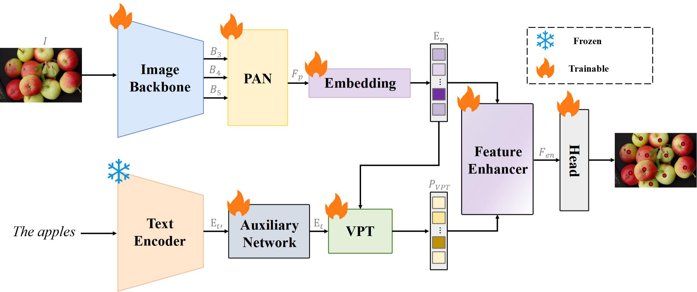
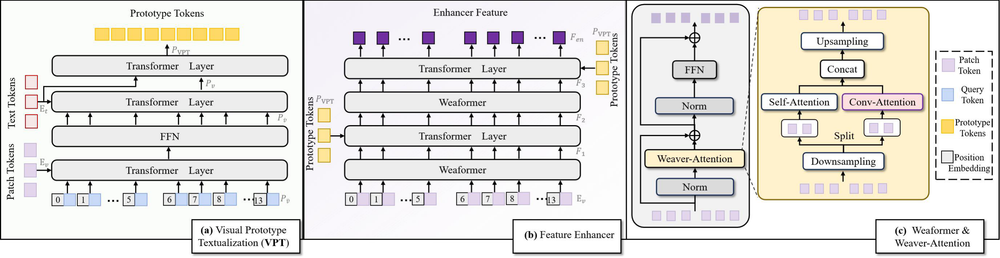

# RT-Counter: Real-Time Text-Guided Open-Vocabulary Object Counting

Hao-Yuan Ma, Li Zhang, Zhiwei Zhu, Jie Gao - School of Computer Science and Technology, Soochow University

[[arXiv]](https://arxiv.org/abs/2606.17561)

RT-Counter counts objects named by a text prompt. This repository is a modular public-code reorganization built around YOLOE, a visual-prototype path, a feature enhancer, and a point head.

> **Release status (2026-10-05).** The default interaction path is restored from the user-supplied `YOLOECountModel` reference: prototype extraction, text-feedback residual normalisation, residual prototype MLP, text-plus-prototype context, and its FIM. The default release scope deliberately omits the reference model's separate pre-FIM `context_self_attention` and `context_norm` step, so the prototype context reaches FIM without an additional context self-attention layer. It retains the reference FIM's internal visual and context self-attention. This is not the complete `YOLOECountModel`: the release backbone, visual embedding, head, loss, and training protocol remain unchanged. It therefore does not claim full source-model equivalence, paper-code consistency, or experimental reproduction. No paper-trained checkpoint or verified metric reproduction is provided here.

## Default path: reference prototypes and reference FIM

The default configuration is `enhancer_type=reference_fim` and `vpt_type=reference`.

1. Sixteen learned prototype queries, initialized as the reference does, cross-attend to visual tokens.
2. Each prototype cross-attends to the one text token, then uses the reference residual-plus-LayerNorm update and residual MLP.
3. The FIM context is `Concat(text, prototypes)`: `[B, 1, D]` followed by `[B, 16, D]`, giving `[B, 17, D]`.
4. The reference FIM applies dynamic two-dimensional sine positions, visual self-attention, context self-attention, visual-to-context cross-attention, and an MLP in each block.

The prototype path has neither the former release's final `SelfAttn(Concat(prototypes, text))` nor the supplied reference's separate pre-FIM `context_self_attention/context_norm` layer. The latter omission is deliberate so that no additional context self-attention is inserted before FIM. The FIM's own `x` and `y` self-attention operations remain part of the selected source interaction path.

The V2 single-text-token FIM, historical spatial FIM, and former Weaformer implementation remain explicit optional backends. Selecting them does not establish paper equivalence.

> **Paper figures and values.** The diagrams and results below are reference material reported by the paper. They do not demonstrate that the current implementation or its outputs reproduce the paper.

<p align="center"></p>
<p align="center"></p>

## Paper-reported results (not reproduced by this repository)

The following values are transcribed from the cited paper; they are not measurements of this codebase.

| Dataset | Val MAE | Val RMSE | Test MAE | Test RMSE |
|---|---:|---:|---:|---:|
| FSC-147 | 12.56 | 51.25 | 13.30 | 104.63 |
| REC-8K | 5.26 | 17.26 | 5.72 | 18.19 |
| CARPK | N/A | N/A | 4.81 | 7.61 |

The paper also reports 38M parameters, 21.37 GFLOPs, and 112.48 FPS on 384 x 384 inputs on an RTX 3090. Those are paper-reported values, not benchmarks of this repository.

## Installation

```bash
conda create -n rtcounter python=3.10 -y
conda activate rtcounter
pip install torch==2.0.1 torchvision==0.15.2 --index-url https://download.pytorch.org/whl/cu118
pip install -r requirements.txt
```

Download the YOLOE-11s weights and the MobileCLIP-B(LT) text encoder into `weights/`:

```bash
mkdir -p weights
huggingface-cli download jameslahm/yoloe yoloe-11s-seg.pt --local-dir weights
wget -P weights https://docs-assets.developer.apple.com/ml-research/datasets/mobileclip/mobileclip_blt.pt
```

## Data

**FSC-147.** Get [FSC-147](https://github.com/cvlab-stonybrook/LearningToCountEverything), plus `FSC-147-D.json` from [CounTX](https://github.com/niki-amini-naieni/CounTX). The descriptions in that file, such as `the apples`, are prompts.

```text
FSC147/
|-- images_384_VarV2/
|-- annotation_FSC147_384.json
|-- Train_Test_Val_FSC147.json
|-- ImageClasses_FSC147.txt
`-- FSC-147-D.json
```

**CARPK.** Use `Images/`, `Annotations/`, and `ImageSets/{train,test}.txt`. Box centres are point labels and `car` is the prompt.

**REC-8K.** Use `rec-8k/` for images and `anno/{annotations,splits}.json` for annotations and prompts.

## Training

```bash
python tools/train.py --dataset fsc147 --data_root /path/to/FSC147 --output_dir runs/fsc147
python tools/train.py --dataset rec8k  --data_root /path/to/REC-8K --output_dir runs/rec8k
python tools/train.py --dataset carpk  --data_root /path/to/CARPK --output_dir runs/carpk
```

These commands use the release defaults, `reference_fim` and the text-plus-16-prototype reference context. They are implementation defaults, not paper-verified defaults. `reference_fim` requires `--vpt_type reference` while VPT is enabled; `--no_vpt` is the explicit ablation that supplies the original single text token directly.

`reference_fim` rejects historical-FIM and Weaformer-only tuning flags so they cannot be silently ignored. Training uses mixed precision on CUDA, writes `last.pt` for resumption, and writes `best.pt` from the selected validation loader. The current CARPK code selects checkpoints on its test split; this remains an unresolved audit limitation and is not a benchmark-protocol claim.

### Optional V2 path

```bash
python tools/train.py --dataset fsc147 --data_root /path/to/FSC147 \
  --output_dir runs/fsc147-v2 --enhancer_type v2_fim --vpt_type v2
```

The retained V2 path uses its own gated single-text-token prototype fusion and learned 2,304-token position table. It is not compatible with the reference 17-token context.

### Optional historical FIM backend

```bash
python tools/train.py --dataset fsc147 --data_root /path/to/FSC147 \
  --output_dir runs/fsc147-historical-fim --enhancer_type historical_fim \
  --fim_downsample_ratio 2
```

Historical FIM fixes the global/local channel split at 1:1 and its local dilations at `[1, 3]`. Its downsampling ratio is measured on each spatial side; `2` therefore reduces the visual token count by four. The historical path rejects a ratio below 2 and rejects Weaformer-only flags.

### Optional former Weaformer backend

```bash
# Former public-release enhancer and prototype-text path.
python tools/train.py --dataset fsc147 --data_root /path/to/FSC147 \
  --output_dir runs/fsc147-weaformer --enhancer_type weaformer --vpt_type legacy

# Weaformer-specific tuning flags are valid only for this backend.
python tools/train.py --dataset fsc147 --data_root /path/to/FSC147 \
  --output_dir runs/fsc147-weaformer --enhancer_type weaformer --vpt_type legacy \
  --downsample_rate 4 --global_ratio 0.25
```

The retained Weaformer configuration defaults are `downsample_rate=4`, `global_ratio=0.25`, and `local_kernel=3`. `local_kernel` remains a `RTCounterConfig` setting rather than a training CLI flag. `--fim_downsample_ratio` is accepted only for `historical_fim`.

## Evaluation and demo

```bash
# Measure a local checkpoint. Results do not by themselves establish paper reproduction.
python tools/test.py --ckpt runs/fsc147/best.pt --dataset fsc147 --data_root /path/to/FSC147

# Count one image and draw predicted points.
python tools/demo.py --ckpt runs/fsc147/best.pt --image apples.jpg --prompt "the apples"

# Measure parameters, FLOPs, and FPS for a local checkpoint.
python tools/benchmark.py --ckpt runs/fsc147/best.pt
```

Evaluation feeds the whole image, resized to a multiple of 32, through the network.

Text embeddings of known categories can be pre-computed so inference can skip the text encoder:

```bash
python tools/export_text_embeddings.py --prompt_file categories.txt --output text_embeddings.pt
```

```python
from rtcounter.engine import load_model

model, _ = load_model("runs/fsc147/best.pt", "cuda")
model.text_encoder.load_cache("text_embeddings.pt")
counts, points = model.count(images, ["the apples"])  # images: [B, 3, H, W] in [0, 1]
```

`load_model` uses strict state loading. For checkpoints predating selector fields, it distinguishes reference FIM blocks (such as `norm_x` and `selfattn_x`) from V2 FIM blocks (such as `norm0` and `selfattn`), and similarly distinguishes reference, V2, and legacy VPT state layouts. It refuses an unknown unlabelled layout instead of guessing compatibility. An experienced caller may pass an explicit selector override only after verifying the checkpoint architecture.

## Code structure

| Component / reference | Code |
|---|---|
| Image backbone and PAN | `rtcounter/backbone.py` - `YOLOEBackbone` |
| Text encoder | `rtcounter/backbone.py` - `TextEncoder` |
| Visual embedding | `rtcounter/embedding.py` - `VisualEmbedding` |
| Default reference prototype context | `rtcounter/vpt_reference.py` - `ReferenceVPT` |
| Default reference feature interaction | `rtcounter/fim_reference.py` - `ReferenceFIM` |
| Optional V2 prototype extraction and gated fusion | `rtcounter/vpt_v2.py` - `VisualPrototypeExtractor`, `PrototypeFusion`, `V2VPT` |
| Optional V2 feature interaction | `rtcounter/fim_v2.py` - `V2FIM` |
| Optional historical spatial FIM | `rtcounter/fim.py` - `HistoricalFIM` |
| Optional former VPT | `rtcounter/vpt.py` - `VPT` |
| Optional former Weaformer enhancer | `rtcounter/weaformer.py` - `FeatureEnhancer`, `Weaformer`, `WeaverAttention` |
| Prediction head and anchors | `rtcounter/head.py` |
| Matching and losses | `rtcounter/loss.py` |

### Backend controls

| Purpose | Command / setting |
|---|---|
| Default reference path | `--enhancer_type reference_fim --vpt_type reference` |
| Optional V2 path | `--enhancer_type v2_fim --vpt_type v2` |
| Historical FIM | `--enhancer_type historical_fim --fim_downsample_ratio 2` |
| Former Weaformer plus former VPT | `--enhancer_type weaformer --vpt_type legacy` |
| Weaformer downsampling or global-channel ratio | `--enhancer_type weaformer --downsample_rate ... --global_ratio ...` |
| Disable VPT | `--no_vpt` |
| Change enhancer depth or number of prototypes | `--enhancer_depth ... --num_prototypes ...` |

## Tests

```bash
python -m unittest discover -s tests -v
```

## Citation

```bibtex
@article{ma2026rtcounter,
  title   = {RT-Counter: Real-Time Text-Guided Open-Vocabulary Object Counting},
  author  = {Ma, Hao-Yuan and Zhang, Li and Zhu, Zhiwei and Gao, Jie},
  journal = {arXiv preprint arXiv:2606.17561},
  year    = {2026}
}
```

## Acknowledgements

RT-Counter builds on [YOLOE](https://github.com/THU-MIG/yoloe), [Ultralytics](https://github.com/ultralytics/ultralytics), and [MobileCLIP](https://github.com/apple/ml-mobileclip). The point-matching formulation follows [P2PNet](https://github.com/TencentYoutuResearch/CrowdCounting-P2PNet). The FSC-147 text descriptions come from [CounTX](https://github.com/niki-amini-naieni/CounTX).

YOLOE and Ultralytics are released under AGPL-3.0, which also applies to code that depends on them.
